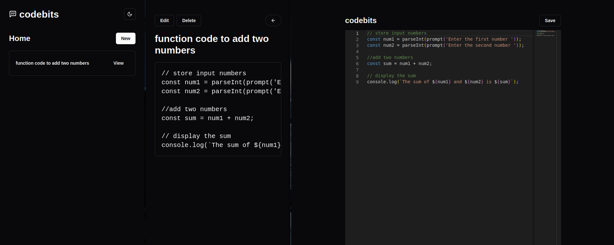

# CodeBits

CodeBits is a web application for managing, sharing, and exploring code snippets. It offers a rich set of features for developers to enhance productivity by organizing code snippets in an intuitive and efficient way.

## Features

- **Code Editing**: Powered by Monaco Editor for a rich coding experience.
- **Theming**: Light and dark mode support using `next-themes`.
- **Organized Snippets**: Categorize and manage your snippets effectively.
- **Dropdown Menus**: Seamlessly integrated UI components using Radix UI.
- **Prisma Integration**: Database management with Prisma for storing and querying snippets.
- **Responsive Design**: Styled with Tailwind CSS and optimized for all devices.

## Technologies Used

- **Next.js**: Framework for server-side rendering and static site generation.
- **React**: For building the user interface.
- **Tailwind CSS**: For styling and animations.
- **Monaco Editor**: Code editor for editing snippets.
- **Radix UI**: For accessible UI components.
- **Prisma**: Database ORM for managing snippet data.

## Getting Started

### Prerequisites

Ensure you have the following installed:

- Node.js (>= 16)
- npm or yarn
- PostgreSQL (for Prisma)

### Installation

1. Clone the repository:

   ```bash
   git clone https://github.com/yourusername/codebits.git
   cd codebits

2. Install dependencies:

   ```bash
   npm install
   # or
   yarn install

## Demo


